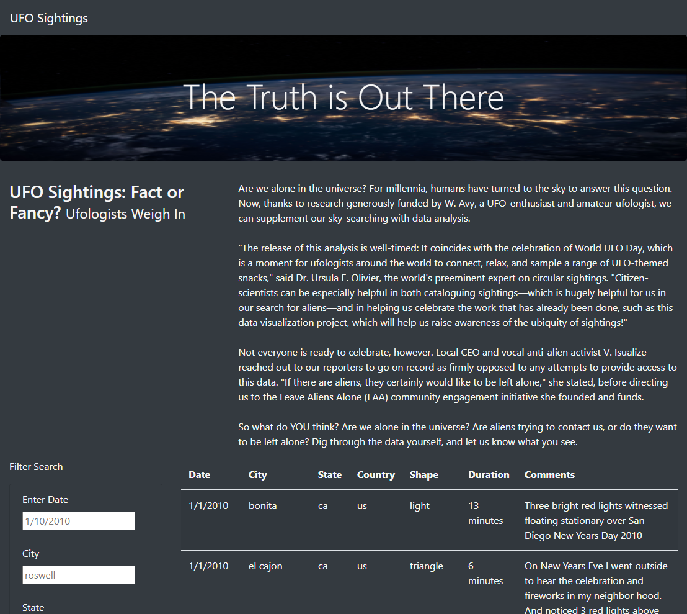
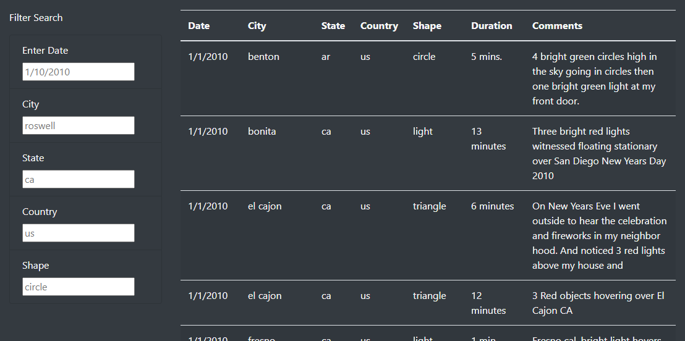
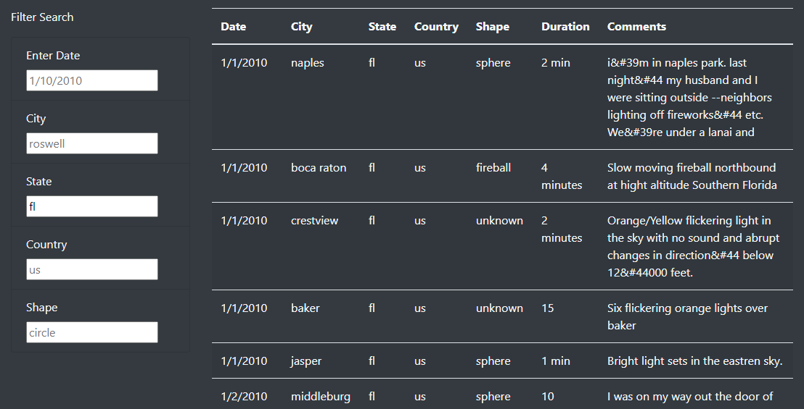
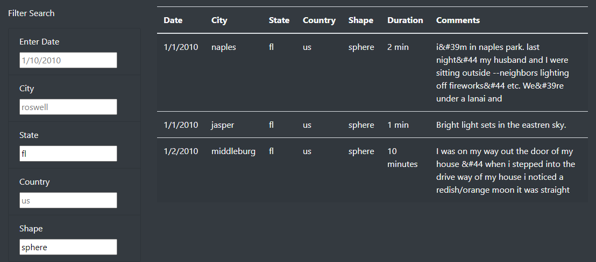
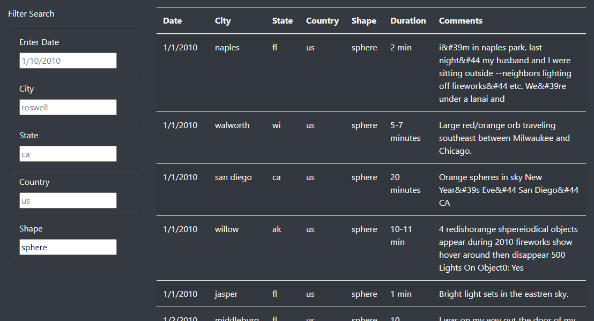

# Challenge - The Truth is Out There, UFOs

## GitHub Pages

**You can see a live version of this webpage here: [UFOs - The Truth is Out There](https://sdcoulter.github.io/bc/module11/index.html)**

## Challenge - Overview

The purpose of this module, challenge, and analysis was to display data about UFO sightings in a pleasing and user-friendly way. We were provided with a JavaScript file that contained the data as an array of objects, made up of key-value pairs. We would be importing the data and using JavaScript written by ourselves to show it in a table that a user may interact with. We also employed the use of HTML/CSS with Bootstrap to make a responsive web app.

Our JS [app](static/js/app.js) file contains multiple functions, the first of which builds the table in HTML to display on the website. The other functions rely on the JS module `D3` to listen for changing input data and then filter the data displayed in the table accordingly. For example, a user could enter a specific country which would filter the table, and then they could further filter it with shape while it automatically updated.

We wanted to show the data to the user in an understandable and interactive way. This meant using a pleasing design (Bootstrap, along with some of our own CSS), and a JS script that had an event listener for changes rather than watching a button for clicks.

## Challenge - Results

When a user visits the site, they are met with the following layout:

Which is made up of a navigation bar, jumbotron-style banner, and an article with a header, before we get to the data being displayed in a table. Scrolling down the page we can see that the page contains a filter that applies to the table and the data being displayed in the table itself. It is currently not filtered so all the data is being displayed.

On the left under the filter heading is the list of filters we can apply to the data table, we have five options to choose from, and we can filter by as many of them as we would like. They are currently populated with placeholder text to give the user an idea of the expected input. The user needs to simply type in any of the filters they wish to enact - we will start with state first, using `fl` for Florida:

After the filter is entered, clicking anywhere else on the page allows the event listener to check for a change in the input boxes and filter accordingly if there has been a change. Since we entered the filter `fl`, the `updateFilters()` function was run in `app.js`, and this state filter was added to our `filters` object as a property with a value. This filter is then applied to the data in the `filterTable()` function, which then runs the `buildTable()` function to return the now-filtered data in a new table. This is all done instantaneously and automatically updates the page the user is interacting with.

We can add a second filter to refine the results further, this time we will use the shape filter with `sphere`:

Again, the data in the table is updated immediately in the same way as before, except this time our `filters` object is filtering the data by two properties rather than just one. We did this by looping through the object's properties and applying the filters on top of one another, so we only return data that was true for both.

We can also remove our filters as well, built into the `updateFilters()` function is a check for whether the user entered information was removed from the input box. If it was, then the function removes that property from our object but leaves the rest, and the table is re-built again. We can see this in action by removing our first filter, `fl`, and seeing the results for just the shape.

This makes the table very interactive for the user as they can filter by whichever classifications they like in real-time.

## Challenge - Summary

### Drawbacks of the Design

A drawback to the design is that that when a user has entered multiple filters, **in order to return to the default, unfiltered, set of data, they must one-by-one remove them**. This means selecting the text in the input, removing it, and repeating up to 4 more times. To make this easier for the use we could include a clear filters button that does this for them, so they can return to the "home" table much easier.

Another drawback to the design is that by making the table update each time a new filter is entered, we end up having **to run through the whole table of data multiple times for multiple filters, when we only needed to run through it once all the filters were entered**. This is not an issue for the amount of data we're currently employing (a little over 100), but if we included more sightings or allowed users to add they're own this dataset gets very big very fast. Having to filter immediately with a large dataset means that the results could be returned slower, rather than performing the multi-filter all at once.

### Ideas for Future Development

The first idea for future development could be to include the ability for the users to add their own sightings to our dataset. This would have to be controlled by making sure no wrong datatypes were entered into the wrong fields and to ensure we did not end up with messy data. Once we have people entering their own sightings, we could include the ability to create accounts to interact with other's sightings and include more data about their own.

If we wanted to leave the service anonymous at first, we would just give the user a new page to fill out their own sightings following the guidelines of data entry, and we could add that to our dataset that we serve up to the rest of the users. We could make each sighting clickable in the table to return a new page so users could find more information and give them the ability to comment on each others sightings.

Along with the ability to comment we can include a button for users to click to state that they witnessed a sighting too. This data could be automatically updated in the dataset and become part of the table so other users filtering by their own region can see which sightings were seen by more people. This idea goes along with the previous two in making the site more interactive and engaging for the user, so they can play more of a role and therefore feel more engaged.

Other ways to organise the data could include the ability to have elements in the table be clickable in their own right, to filter the data - for example: a user could scroll through the whole list and instead of entered a city name they could click a city in the table data and the data would automatically filter by that city. This could work for state, country, and shape too. This makes filtering even easier for the user as they do not need to worry about correct spelling, or if the search term they're using is featured in the table.

Expanding on the last point, when a user types in a city they have no way of knowing if that city is in the dataset, or if they are spelling the city correctly. We could make the filter input box more interactive by providing an automatically updating drop-down list for the users to see as they type the first few letters of a city name - for example: when a user types `row` a drop-down list would pop up with city names that begin with those letters, and as more letters are entered it is refined further to show cities that actually exist in the data.

As the user entering the correct format is important in the filtering, we would want to refine the rest of the filters in this way too. Cities is such a large category that this seems like the best filtering option, but for country, state, and shape we could use a simple drop-down list of the limited number of unique entries. For the date we would likely want to move away from the user typing in a date and instead have a calendar widget that they can scroll through to choose a particular date, so they format they enter doesn't have an impact on the results.

Taking the date a step further we could instead (or as well as) offer the ability to select a date range, or a particular month or year, and filter the data that fits in the range. This would give users a more realistic idea of sightings in a particular area rather than trying exact dates.

One final change we could make would be to the visual elements of the page. We could try moving the filter list to a horizontal layout that goes along the top of the table instead of at the side, and as the user scrolls the filters would stay at the stop of the screen so you could interact with them as you scroll down the data. General other visual elements could be employed in the CSS of the website to make the filter labels and the input boxes line up with each other vertically. We could also include hover elements in the table so that you could use your mouse to highlight a row and more easily see the connected data.

## Context

This is the result of Module 11 of the University of Toronto School of Continuing Studies Data Analysis Bootcamp Course - **JavaScript and HTML/CSS (Web Deployment)** - UFO Sightings with JavaScript. Following the guidance of the module we end up pushing this selection of files to GitHub.
